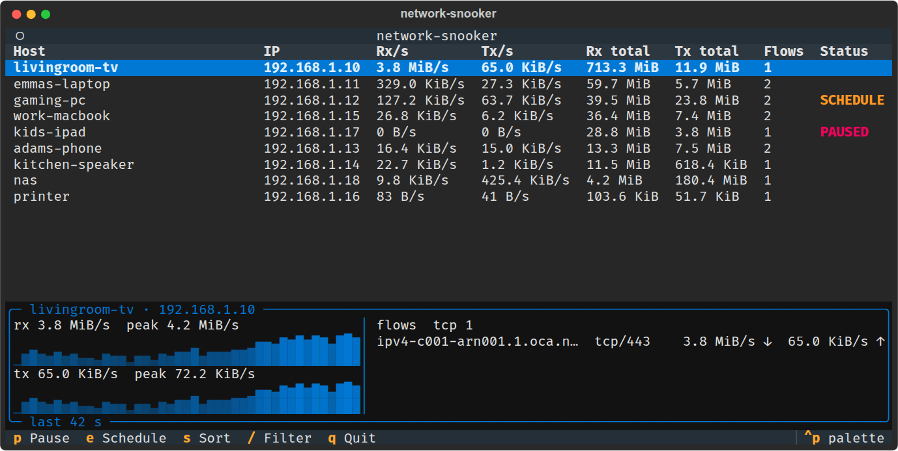
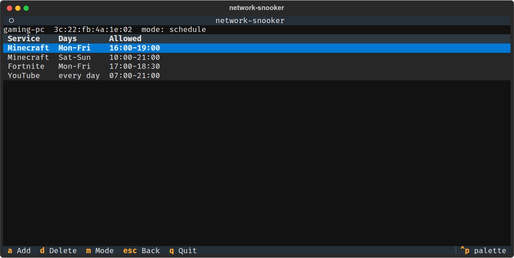

# Network Snooker

[](https://github.com/adeptum-labs/network-snooker/actions/workflows/tests.yml)
[](https://github.com/adeptum-labs/network-snooker/blob/master/LICENSE)

A terminal view of live per-host traffic on a Linux router. It reads
connection tracking to show what each device on the LAN is talking to, and
can block services for a host, on a schedule if needed, through nftables.





## Requirements

- Python 3.11 or later (not needed with the Debian package)
- Root privileges
- `conntrack`, and `nft` for blocking

## Usage

### From a Debian package

Each release on GitHub has a `.deb` for amd64 and arm64. It bundles Python
and every library, so nothing else needs installing besides `conntrack` and
`nftables`, which the package pulls in:

```sh
sudo apt install ./network-snooker_<version>-1_<arch>.deb
sudo network-snooker
```

The package is built on Debian 12 and runs on Debian 12 and later and on
Ubuntu 22.04 and later.

### Single-file executable

Each release also has `network-snooker-linux-<arch>`, one file that bundles
Python and every library. It needs only `conntrack`, `nft` and `ip` on the
machine, which most routers already have:

```sh
chmod +x network-snooker-linux-amd64
sudo ./network-snooker-linux-amd64
```

It unpacks itself into a temporary directory on each start, so it starts a
little slower than the installed package.

### From source

```sh
pip install .
sudo network-snooker
```

`--interval SECONDS` sets the poll interval and `--lan CIDR` (repeatable)
overrides the detected LAN subnets.

### Background daemon

Capture, schedules and blocking run in a daemon that the terminal view starts
the first time it runs and that keeps going after you quit with `q`. Blocks
and schedules stay in force, and traffic totals keep accumulating, until the
daemon stops. The view is only a frontend for it, so reopening it shows
everything gathered while it was closed.

- `sudo network-snooker` starts the daemon if needed and connects to it.
- `Q` (shift+q) quits the view and stops the daemon, lifting every block.
- `sudo network-snooker stop` stops the daemon from another shell.
- `sudo network-snooker daemon` runs the daemon in the foreground, for
  example under a service manager.

`--interval` and `--lan` take effect when the daemon starts; a daemon that is
already running keeps the settings it started with. Its log is
`/var/log/network-snooker.log`. Traffic totals are held in memory, so they
start over when the daemon restarts.

## License

Copyright © 2026 Adam Waldenberg, Adeptum AB. Licensed under the GNU General
Public License, version 3 or later. See [LICENSE](LICENSE).
